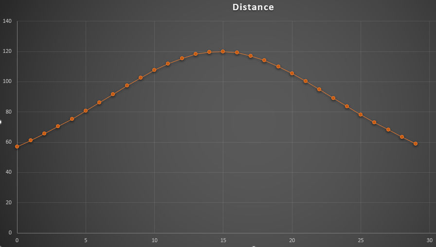
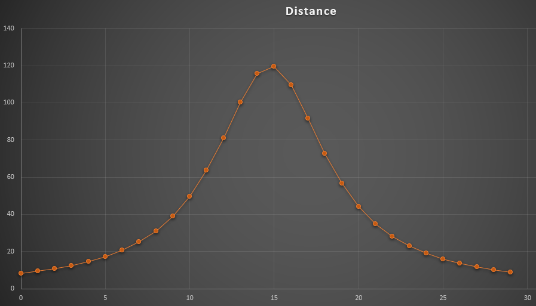

# Exposure Templates

_Exposure Templates_ provide the ability to set several exposure-related properties that are commonly used for the associated filter and the rig described by the applicable profile.  Configurable properties include gain, offset, binning, and camera readout mode.  You can also set the level of twilight and the moon avoidance parameters appropriate for the filter.

Each [Exposure Plan](exposure-plans.html) references a single Exposure Template.  With this approach, most of the reusable exposure properties are decoupled from Exposure Plans and easily reused.

{: .note}
Each Exposure Template explicitly references a single filter configured on your filter wheel _by name_.  If you later change the filter name in the filter wheel configuration, you will need to update any Exposure Templates that reference that filter.

## Basic Operations

### Exposure Template Creation

New templates are added by selecting the applicable profile in the Exposure Templates navigation tree and then clicking the Add icon.  The new template is saved, added to the navigation tree, and selected.  Click the Edit icon to make changes.  Note that you will have to set the filter to one of the filters defined in the filter wheel for this profile.

When you select a profile in the Exposure Templates navigation tree, the right panel shows a table of all templates for that profile.  From there, you can jump to the view/edit panel for the template or copy it to the clipboard.  After copying a template, you can paste it under this profile or select a different profile in the tree and paste it there.

### Exposure Template Editing

Click the Edit icon to begin editing the template.  The property value fields become active and you can make changes.  Note that you typically have to tab out after editing to enable the Save icon.

When done, click the Save icon to save your changes or the Cancel icon to cancel.

### Exposure Template Properties

|Property|Type|Description|
|:--|:--|:--|
|Name|string|The name of the template|
|Filter|dropdown|The name of the associated filter on the filter wheel for the profile.|
|Default Exposure|double|The default exposure duration to use unless overridden in Exposure Plans.  Exposure plans using the template default will pick up a change on the next planning run.|
|Gain|integer|The desired gain setting for the exposure.  Leave blank to use the default defined for the camera.|
|Offset|integer|The desired offset setting for the exposure.  Leave blank to use the default defined for the camera.|
|Binning|dropdown|The binning mode for the exposure.|
|Readout Mode|integer|The desired readout mode setting for the exposure.  Leave blank to use the default defined for the camera.|
|Acceptable Twilight|dropdown|The brightest level of twilight that is suitable for using this filter.|
|Moon Avoidance|boolean|Enable/disable the moon avoidance calculation - see below.|
|Avoidance Separation|double 0-180|The separation angle for the moon avoidance calculation - see below.|
|Avoidance Width|integer 1-14|The width in days for the moon avoidance calculation - see below.|
|Maximum Humidity|double|Not currently implemented.|

### Moon Avoidance

The Moon Avoidance formula ("_Moon-Avoidance Lorentzian_") was formulated by the [Berkeley Automated Imaging Telescope](http://astron.berkeley.edu/~bait/) (BAIT) team.  The formulation used here is from [ACP](http://bobdenny.com/ar/RefDocs/HelpFiles/ACPScheduler81Help/Constraints.htm).

The formula takes two fixed parameters: _separation_ (aka distance, in degrees) and _width_ (days).  From ACP:
*At full Moon the avoidance will be distance, and width days before (or after) the avoidance will be one half distance.*

If the angular distance from your target to the moon is less than the calculated avoidance separation, the exposure plan will be rejected.  The separation is calculated at the midpoint time between the start and end time imaging times determined in the planner.  As the separation increases or decreases throughout a night, the avoidance determination may change as the planner is called again.

#### Setting Parameters
When enabled, set distance to the minimum acceptable separation at full moon.  Then use width to control how quickly the curve drops from the distance value.  Some charts make this clear: X = moon age in days, Y = calculated distance.

*Distance=120 and width=14*

*Distance=120 and width=4, showing much faster falloff from the peak distance value*

The values used on the ACP site are very conservative.  For narrowband imaging you could get away with distance=60 and width=7 which would need 60° separation at full moon but only 30° at first or last quarter.

